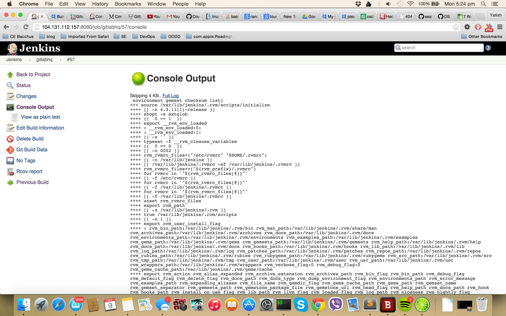
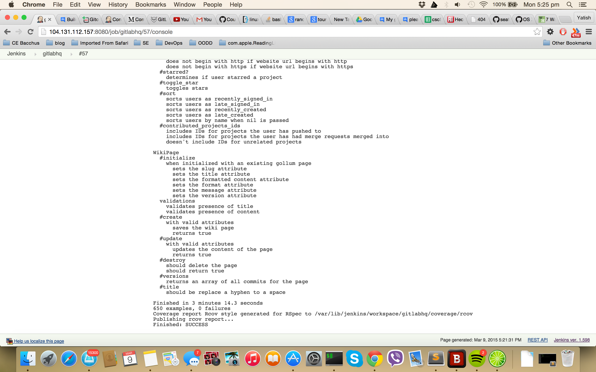
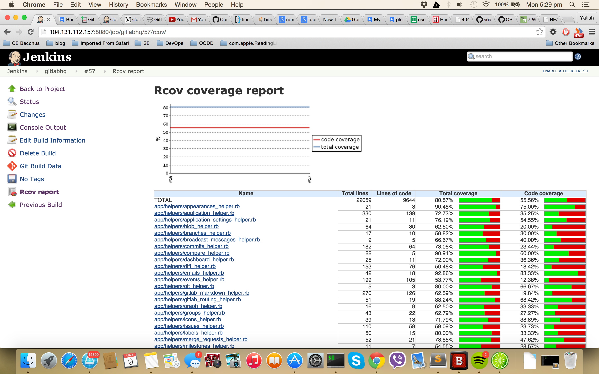
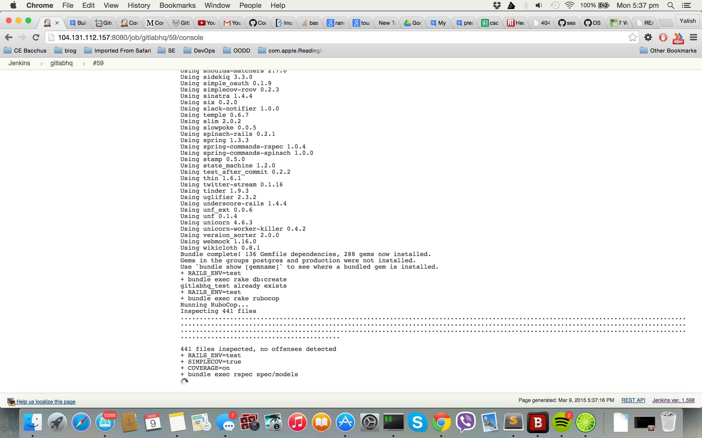
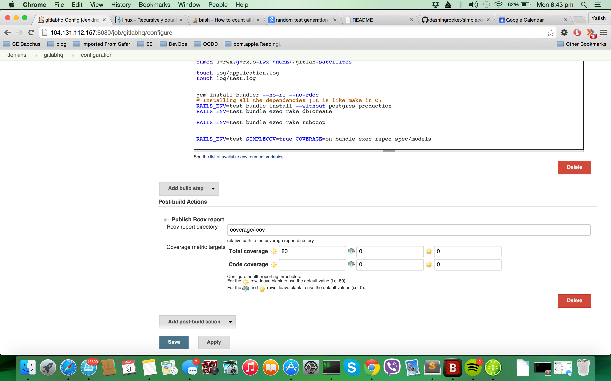

# CI - Pipeline - TEST & ANALYSIS

CSC510 - DevOps Milestone 2 

## Target Project
Continuing from Milestone 1, we are using the same setup and target project. The details about it can be read in [Milestone1-Build](./docs/build.md). 
Few extra packages were required to be installed for setting up the testing setup. Appropriate modification were added in the `gitlab_setup` shell script for those.

## Analysis
To do static analysis we are using a tool called [Rubocop](https://github.com/bbatsov/rubocop). It is static analysis and style check tool for Ruby. It is a well maintained and popularly used tool in the open source community for Ruby projects. It has a plugin architecture to define new rules for static analysis. We have written a custom plugin for custom rule for extended analysis. <link of the plugin code>

## Testing

### Unit/Functional/Integration testing 
Gitlab is a Ruby on Rails application. Rspec is one of the testing framework used for ROR applications. We are using Rspec for Unit tests for Ruby code. Jasmine is used for Javascript unit testing code. 
For integration testing `capybara` and headless chrome browser. 
Gitlab has well defined feature files(functional testing). We are using `spinach` for it.
For measuring the coverage of the test we are using SimpleCOV and for the display on jenkins `ruby-metrics-plugin`

### Test exploration
Gitlab is well defined, massive and huge project with more than 100000 lines of code. It already has good test suite for it models and controllers.
The `requests` section of the test suite could be increased by test exploration technique of fuzzing.
We used the [Tarantula](https://github.com/relevance/tarantula). Tarantual is fuzzy crawler which increases the requests test coverage to check which endpoints are working/ not working.

## Capabilities

* Unit Tests and Coverage

    Running unit tests is a step in the build pipeline.  Below are the green builds after running the tests

    Start
    

    End
    

    Coverage Report
    

* Test Generation/Exporation Technique
    <code for tarantula>
    <2 images of before and after test coverage>

* Base Analysis

    We are using `rubocop`  for base analysis. It checks for static analysis, code complexitiy and style guide violations. The rules for the base analysis are defined in the code repo in the file `rubocop.yml`.

    

* Extended Analysis
    <About custom plugin > What is does

* Gate
    We have set the threshold as 80% for code coverage. If the test coverage is less than 80% the build is marked as a failure. The next steps in the pipeline will not be executed if any of the failure is occured like failure in test, static analysis violation or reduction in code coverage.
     

