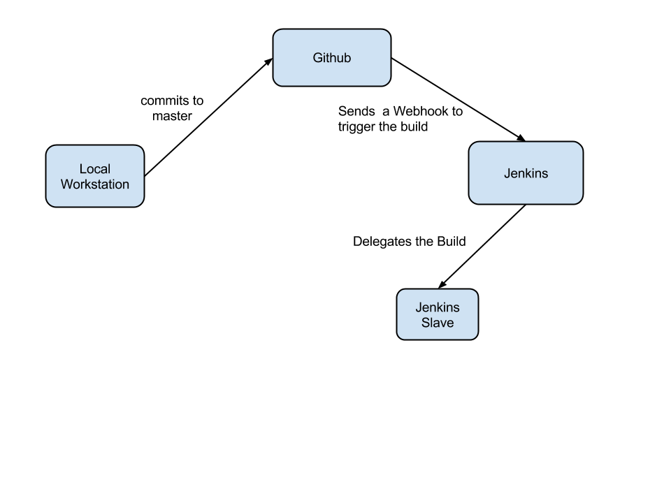
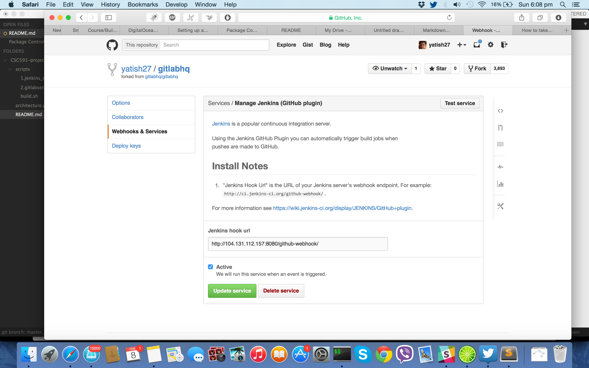
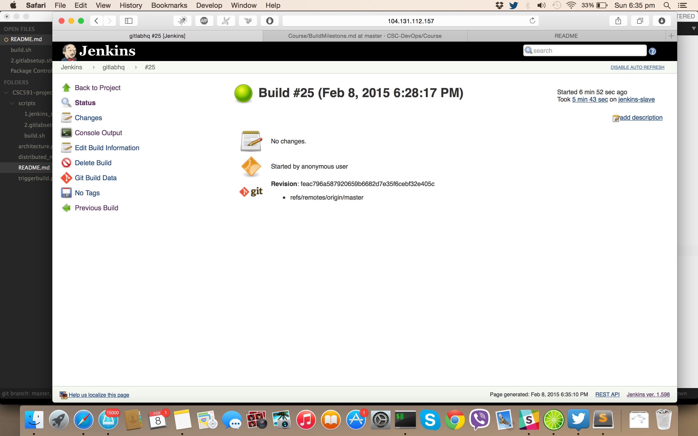
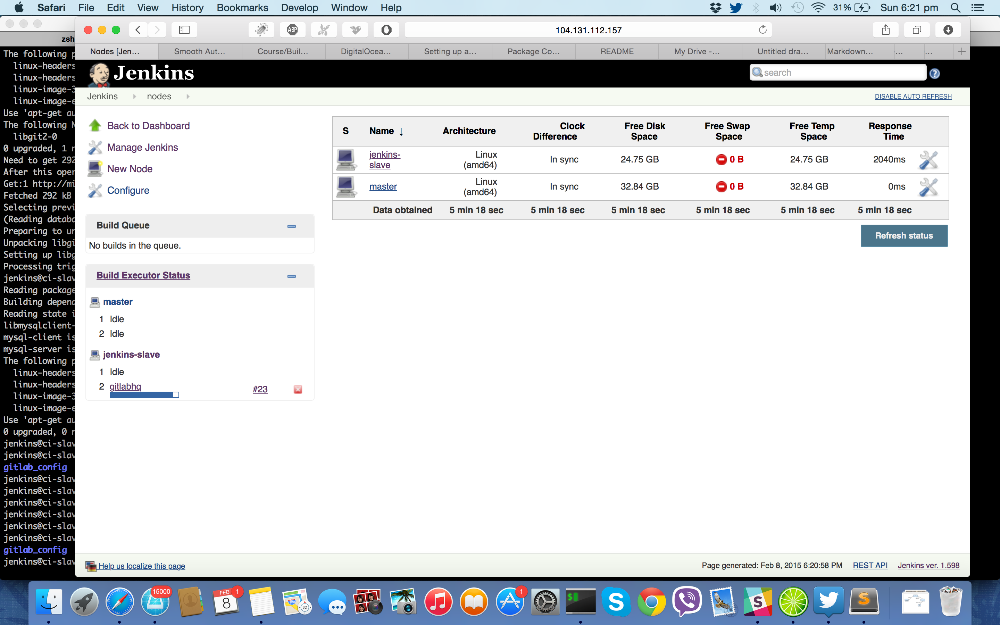

# Continuous Integration - BUILD

CSC591 DevOps

## Target Project
The target project which we are using for our CI pipeline is Gitlab. Gitlab is open source version of github. It is full-fledged Ruby on Rails application. It has extensive stack. It uses Ruby, Rails, SASS, CoffeScript, Redis, GitShell, Postgres, MySQl, Nginx. It uses Sidekiq for background processing. It also uses many C packages to interact with the git server. For testing it uses Rspec(Unit and functional), Capybara(integration), Jasmine(Javascript), Cucumber(Integration). It can be found at [GitlabHQ](http://github.com/gitlabhq/gitlabhq).

## Continuous Integration
To develop the Continuous Integration pipeline for gitlab, we are using open source CI tool called [Jenkins CI](http://jenkins-ci.org/). It provides support for multiple nodes(distributed systems). It has plugin architecture and it integrates with almost all SCM.

## BUILD 

To build the target project we are using our own forked version [fork](http://github.com/yatish27/gitlabhq). this way we have full control and access to the code repository. Hence our git server will be Github.

### 1. Setting up the machine
We are using [Digital Ocean](http://digitalocean.com) to setup the virtual servers. It is similar to AWS EC2. We booted up a 2GB RAM, 2CPU, 40GB SSD Ubuntu 14.04x64 Server for Jenkins Master.
After SSH access to the machine as root, we updated and installed few basic packages. 
You can refer scripts/jenkins_setup.sh. It installs the basic packages. It downloads and installs jenkins. It starts jenkins and it available at port 8080.
When Jenkins is installed it also creates `jenkins` user. The script adds password to jenkins users and adds to sudoers list.
 
### 2. Setup for Gitlab
The jenkins user is going to be used for BUILD. Gitlab requires few special packages to be installed. Hence the `script/2.gitlabsetup.sh`  installs those packages for Gitlab. It also installs RVM and Ruby.
Refer 2.gitlabsetup.sh for details.

### 3. Setup via UI.
Now Jenkins master is running on the master server on port. 

Jenkins Master : http://104.131.112.157:8080

As we are using Git and Github, we installed the git plugin and github plugin from `Manage Jenkins`

Then created a New Job for 

* Name of the Item
* New Job > FreeStyle Project. 
* Add the github URL
* Added a label "gitlabhq"
* Selected "Build whenever a change is pushed on Github"
* Selected "Execute Shell" for build

Gitlab requires few steps as a part of its build process. Converted a shell script of it. `scripts/build.sh`
Everytime a build is called this script wil be executed. It will setup teh config files, install the dependencies of the project, install all the required gems.
Refer build.sh for details.

### 4. Setting Slave
Jenkins provides the ability to setup slave machines. We can delegate the build process to those machines depending upon the requirement.
For the slave node you new a new machine. We booted up a similar machine via Digital Ocean. 
We created a a user `jenkins`. Installed required packages. 
The master Jenkins should be able to SSH to slave, hence we added the SSH key in the authorised hosts.
Using the Master Jenkins UI, We added a new Node. Provided the IP address and credentails. We added the gitlab label, so that we can run the build on the slave. Slave can be configured to run a build based on load, projects label as per required.

### 5. Build based on Trigger
We added a Github Webhook. This is will send a post request to our Jenkins server as soon as something is pushed to "master branch". Hence as soon as the post request is received, it will trigger to build the project.

## Architecture

## Capabilities
1. Triggered Builds

2. Dependency Management
Refer `script/build.sh`. It handles the dependency management for the target project.

3. Build Script Execution
The Build is executed and it is passed. The build is Green

4. Multiple Nodes

5. Status
The status of the build can be seen [here](http://104.131.112.157:8080/job/gitlabhq/25/console). You can navigate to find the status of othe builds

CODE REPO: http://github.com/yatish27/gitlabhq

JENKINS URL: http://104.131.112.157:8080

SLAVE IP: 104.236.31.118

 

