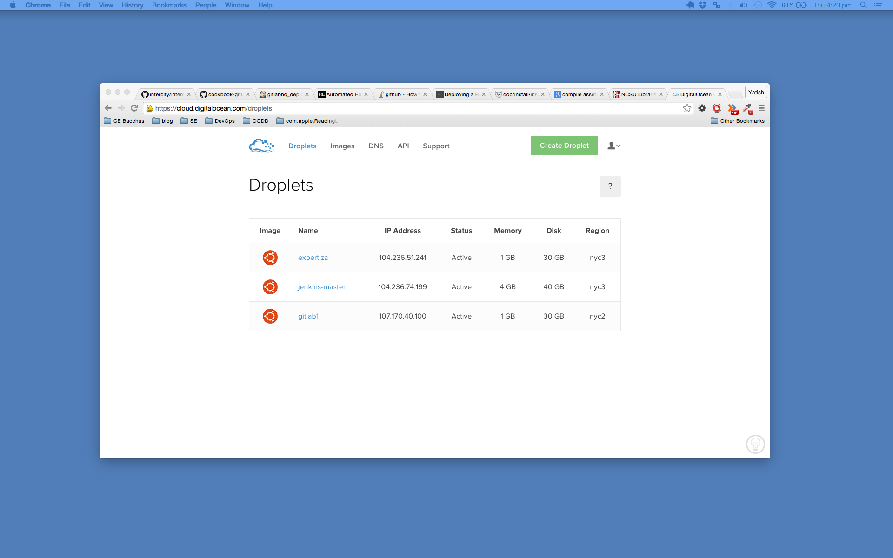
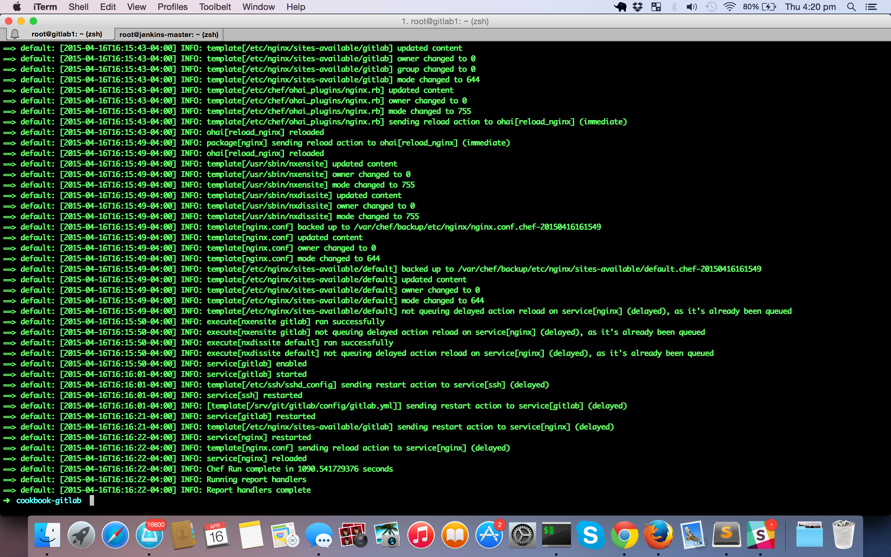
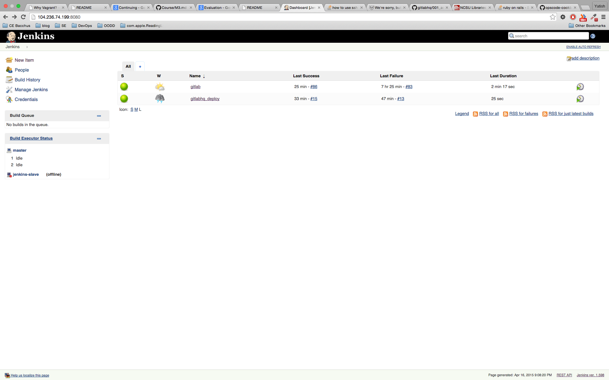
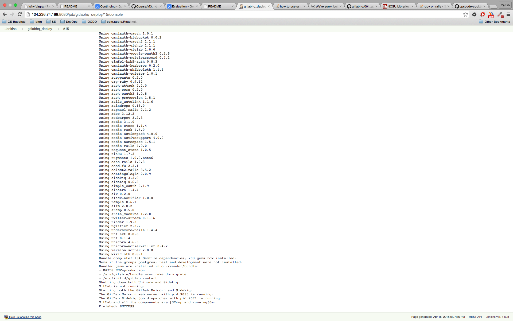
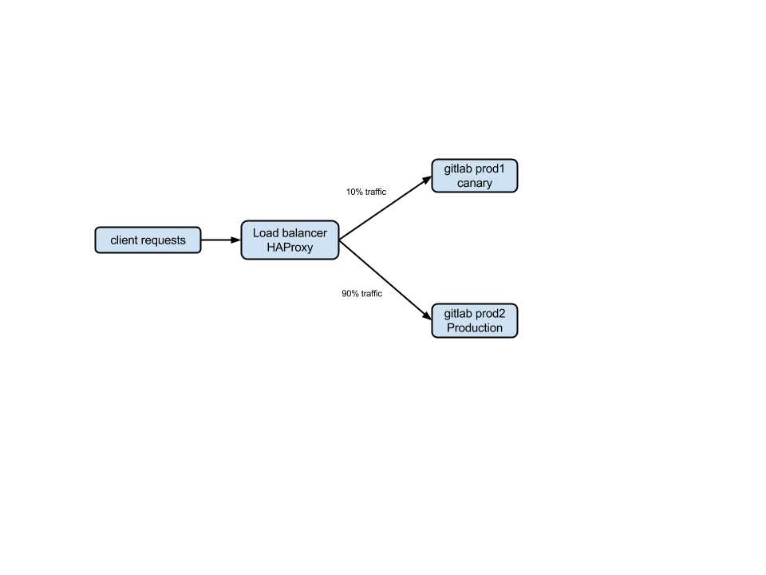
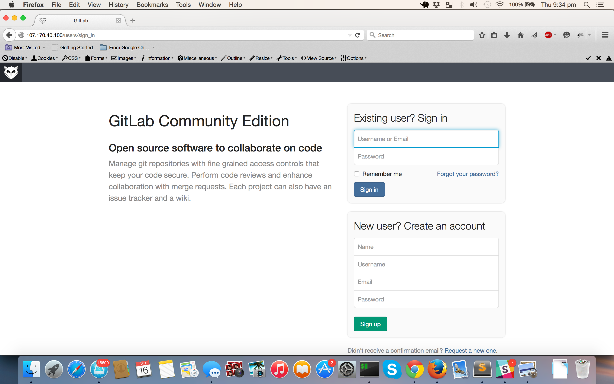
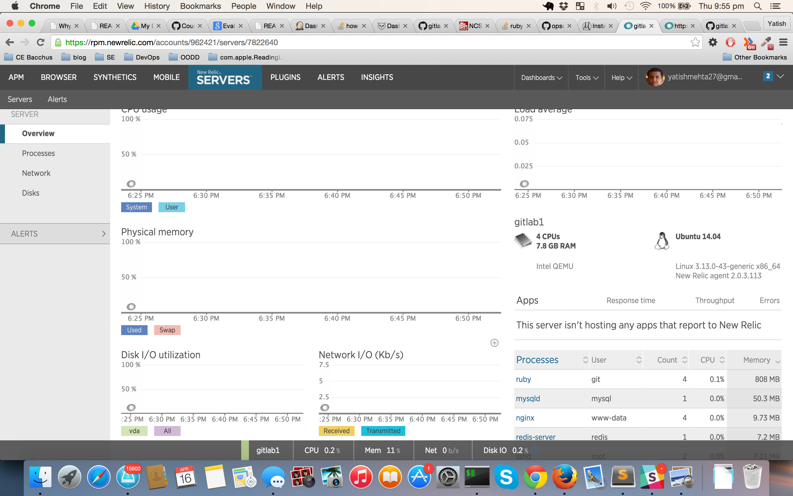
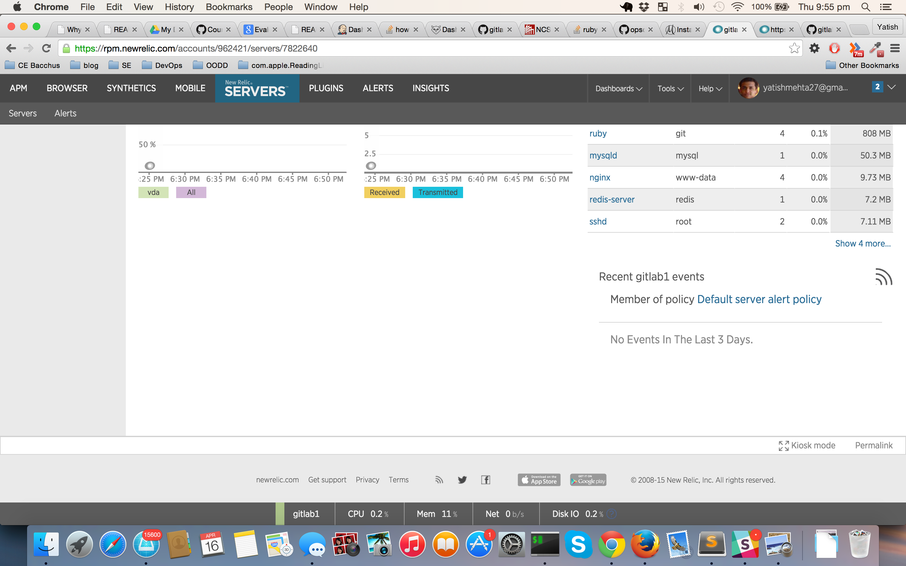

# CI - Pipeline - Deployment

CSC591 DevOps

## Target Project
Continuing from Milestone 2, we are using the same setup and target project(Gitlab). Gitlab is open source version of Github. It is mature, popular and project with complex infrastructure stack using Ruby on Rails, Git, Gitshell, Redis, Nginx, Unicorn. The target app can be found at [Gitlab](http://github.com/yatish27/gitlabhq).
The details of the previous milestones can be found in this same repo
- [Build](https://github.com/yatish27/CSC591-DevOps-Project/blob/master/docs/Build.md)
- [Test](https://github.com/yatish27/CSC591-DevOps-Project/blob/master/docs/Test.md)

## Orchestration/Configuration

*Automatic deployment environment configuration*

To setup the production infrastructure automatically, we used Vagrant and chef solo. The machine was setup on Digital Ocean. This setups up all the packages, databases, redis. It also clones the repo and seeds the required initla values for the database.
* Digital Ocean: It is a cloud provider which was used to boot virtual servers.
* Vagrant: Vagrant has plugin for Digital Ocean. we set up the machine using the APIKey and Vagrantfile.
* Chef: Chef was used as the provisioning tool. The chef cookbook used to orchestrate the server is present in this repo
Below is the Vagarantfile setup
```
# -*- mode: ruby -*-
# vi: set ft=ruby :
Vagrant.configure("2") do |config|
  config.vm.box = "gitlab"
  config.vm.hostname = "gitlab1"

  config.vm.provider :digital_ocean do |provider, override|
    override.ssh.private_key_path = '~/.ssh/id_rsa'
    override.vm.box = 'digital_ocean'
    override.vm.box_url = "https://github.com/smdahlen/vagrant-digitalocean/raw/master/box/digital_ocean.box"

    provider.token = 'addyourowntoken'
    provider.image = 'ubuntu-14-04-x64'
    provider.region = 'nyc2'
    provider.size = '8gb'
  end

  config.omnibus.chef_version = "11.4.4"
  config.berkshelf.enabled = true

  config.vm.provision :chef_solo do |chef|
    chef.json = {
      :gitlab => {
        :host => "devops.com",
        :url => "http://devops.com"
      },
    }
    chef.run_list = ["gitlab::default"]
  end
end

```

The entire cookbook has been added in this repo.[Cookbook]()

Vagrant Setup Done



Chef-Solo



## Deployment
*Deployment of binaries created by build step*

We created a new job which was triggered after the build pipeline was stable. The job copies the basic configuation files. It then deploys the compiled version to the production servers. The deploy script for this job can be found in the scripts folder in the repo. [deploy.sh](./scripts/deploy.sh)

Deploy Job


Successful deploy Job


## Remote deployment
The application infrastruture is deployed on DigitalOcean not on local virtual machines.

## Canary releasing

Canary release is when you deploy incrementally. In our application we have 2 app servers. Both of these app servers are in front of a proxy server using a load balancer HAProxy.
We deploy to canary application server first. If the deployment is successful, there is next job in jenkins pushes the code to production server 
For high scalability we can add more application servers. The first machine will act as the canary and the other machine acts as entire prod infra

PROXY URL http://45.55.167.130

This is the architecture of our infrasturture.


The live application 


## Canary Analysis
For the purpose of analysis and monitoring we are using new_relic. New_relic is popular monitoring and analysis tool especially for Ruby on Rails application.




## References

- https://github.com/gitlabhq/cookbook-gitlab
- http://www.thoughtworks.com/insights/blog/how-deliver-rails-upgrade-using-canary-release
