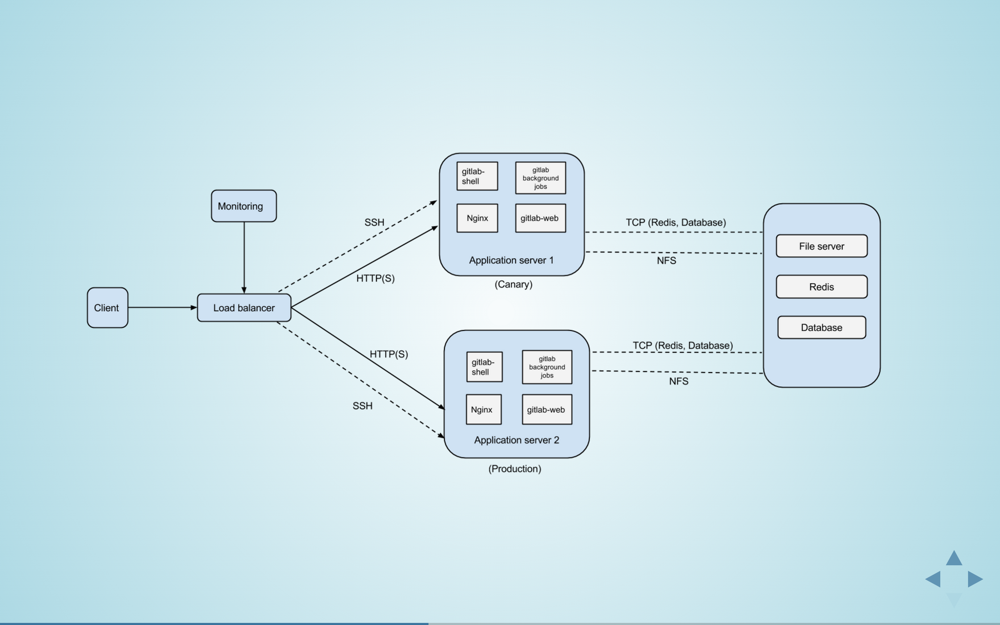
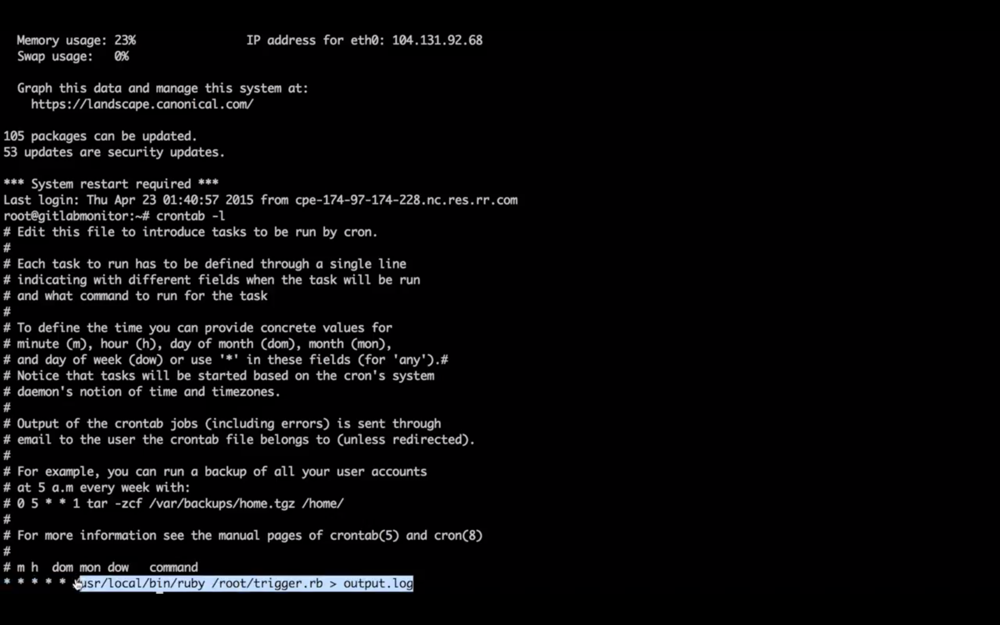
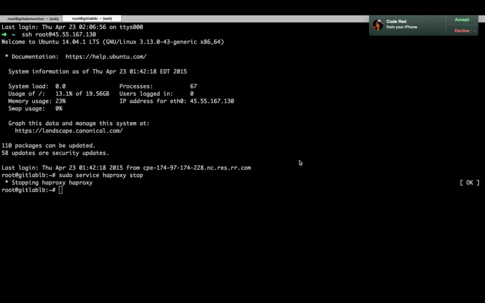

# CI - Pipeline - Special Milestone

CSC591 - DevOps Milestone 4 

## Target Project
Continuing from Milestone 3, we are using the same setup and target project(Gitlab). Gitlab is open source version of Github. The target app can be found at [Gitlab](http://github.com/yatish27/gitlabhq).
The details of the previous milestones can be found in this same repo
- [Build](https://github.com/yatish27/CSC591-DevOps-Project/blob/master/docs/Build.md)
- [Test](https://github.com/yatish27/CSC591-DevOps-Project/blob/master/docs/Test.md)
- [Deploy](https://github.com/yatish27/CSC591-DevOps-Project/blob/master/docs/Deploy.md)

## Special Milestone
For adding a special feature to the CI pipeline, we have introduced a monitoring application that heartbeats the load balancer to check if it is alive. If the server is down or the number of requests exceeds a certain threshold, the system administrator literally receives a call. We have used the Twilio REST API to introduce this feature in the system. This can act as a pager for the DevOps team of the organization.  

## Twilio
Twilio basically uses Amazon Web Services to host telephony infrastructure and provide connectivity between HTTP and the public switched telephone network (PSTN) through its APIs. Twilio provides API for features like Voice messages calling, SMS. It has multiple trigger based API endpoints as well. There are API clients available in many languages. We are using the Ruby API client.  

We are using the trial account at Twilio to make a call to the system administrator. The trial account only allows outgoing calls to verified numbers. With the account upgrade, we can have otugoing calls from the browser to any number(s) specified in the list. Custom voice messages can be triggered. Even SMS can be sent. 
We can set alert triggers based on the hierarchy of the people in the organizaton. Example Send SMS to DevOps if the traffic is high and make a call to the CTO if the site is down.

## Implementation 
We have made a Ruby application which pings the load balancer every 15 seconds to check if it working as expected. If not, the system administrator gets a call from the browser. We have also made sure that the system administrator gets the call only once and the does not keep receiving calls continuously until the system is up and working. We have also set a cron for every minute which invokes this ruby monitoring application.
The entire call history can be seen on the twilio dashboard.

The ruby app can be found in this repo in scripts folder [trigger](https://github.com/yatish27/CSC591-DevOps-Project/blob/master/docs/Deploy.md)

Architecture

Cron 

Once the load balance is down we get a call

## Presentation
A presentation video which gives a brief introduction of the entire project(all four milestones) can be found [here](https://www.youtube.com/watch?v=h0Nvc1B3C90)

